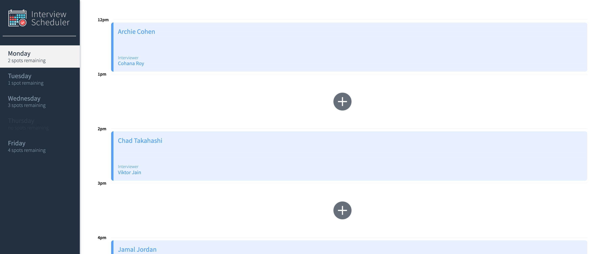
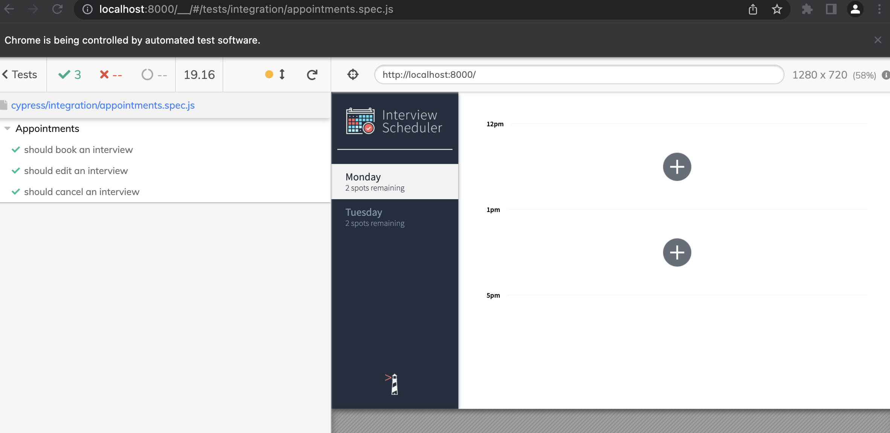

# Interview Scheduler

## Setup
1. Fork and Clone repository. npm -i all dependencies 
2. Fork, clone and setup this api server: https://github.com/lighthouse-labs/scheduler-api . Make sure it's in a separate directory.
3. Run both the client and the server at once.

## Running Webpack Development Server

```sh
npm start
```

## Running Jest Test Framework

```sh
npm test
```

## Running Storybook Visual Testbed

```sh
npm run storybook
```
## Interview Scheduler


## Saving Interviews


## Deleting Interviews


## Editing Interviews


## Error Handling


## Building Assets in Storybook


## Testing with Cypress



## Dependencies

 - axios
 - classnames
- normalize.css
- react
- react-dom
- react-scripts


## Dev Dependencies
  - @babel/core
  - @babel/eslint-parser
  - @storybook/addon-actions
  - @storybook/addon-backgrounds
  - @storybook/addon-links
  - @storybook/addons
  - @storybook/react
  - @testing-library/jest-dom
  - @testing-library/react
  - @testing-library/react-hooks
  - prop-types
  - react-test-renderer
  - sass


